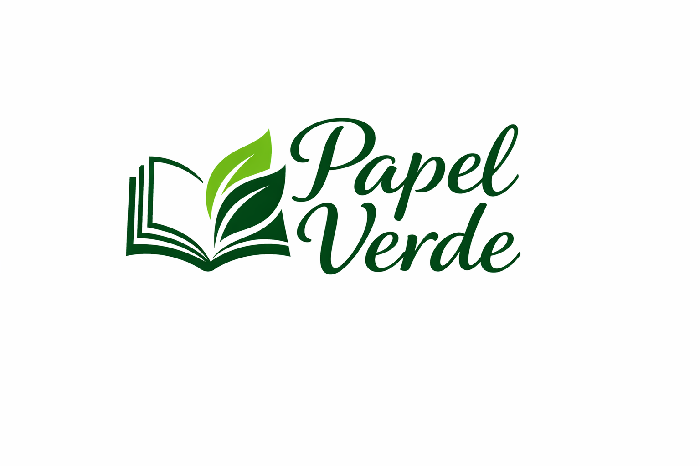

<p align="center">
  
</p>

<p align="center">
  
  
  
  
  
  
</p>

<h1 align="center">Papel Verde - Libreria </h1>

Papel Verde es una librería dedicada a la venta de libros de segunda mano y publicaciones elaboradas con materiales reciclados. Nuestro proyecto nace con el objetivo de fomentar un modelo de negocio ecosostenible, promoviendo la reutilización de recursos y el consumo responsable dentro del mundo de la lectura.

## 📑 Índice

1. [Descripción del Proyecto](#-descripción-del-proyecto)
2. [Objetivos](#-objetivos)
3. [Tecnologías Utilizadas](#-tecnologías-utilizadas)
4. [Landing Page](#-landing-page)
5. [Arquitectura MVC](#-arquitectura-mvc)
6. [Sprints del Proyecto](#-sprints-del-proyecto)
7. [Documentación](#-documentación)
8. [Presentación](#-presentación)
9. [Instalación](#-instalación)

---

## 📖 Descripción del Proyecto

Papel Verde es una librería dedicada a la venta de libros de segunda mano y publicaciones elaboradas con materiales reciclados.

##  Objetivos

- Fomentar la reutilización de recursos.
- Promover el consumo responsable.
- Facilitar el acceso a la lectura mediante productos sostenibles.
- Impulsar un modelo de negocio ecológico.

## 🛠 Tecnologías Utilizadas

- HTML5
- CSS3
- JavaScript ES6
- PHP 8.4
- MySQL 8
- Bootstrap 5

## 🌐 Landing Page

Descripción de la landing page y características responsive.

## 🏗 Arquitectura MVC

Explicación de la organización del proyecto siguiendo el patrón Modelo-Vista-Controlador.

## 📅 Sprints del Proyecto

- Sprint 1
- Sprint 2

## 📂 Documentación

En esta carpeta se encuentran toda la documentación de la aplicación.

##  Presentación

Material de apoyo y presentación final del proyecto.

## ⚙ Instalación


### Requisitos Previos

- XAMPP
- PHP 8.4 o superior
- MySQL 8
- Navegador web moderno

### 1. Clonar o descargar el proyecto

```bash
git clone https://github.com/usuario/PapelVerde.git
```

O descargar el archivo ZIP y extraerlo.

### 2. Copiar el proyecto a XAMPP

Mover la carpeta del proyecto al directorio:

```text
C:\xampp\htdocs\
```

La estructura debería quedar:

```text
xampp/
└── htdocs/
    └── PapelVerde/
```

### 3. Iniciar los servicios

Abrir el panel de control de XAMPP y arrancar:

- Apache
- MySQL

### 4. Configurar la base de datos

1. Acceder a phpMyAdmin:

```text
http://localhost/phpmyadmin
```

2. Crear una base de datos llamada:

```sql
papelverde
```

3. Importar el archivo SQL incluido en el proyecto.

### 5. Configurar la conexión

Modificar los datos de conexión en el archivo de configuración:

```php
$host = "localhost";
$user = "root";
$password = "";
$database = "papelverde";
```

### 6. Ejecutar la aplicación

Abrir el navegador y acceder a:

```text
http://localhost/PapelVerde/
```

La aplicación debería cargarse correctamente.